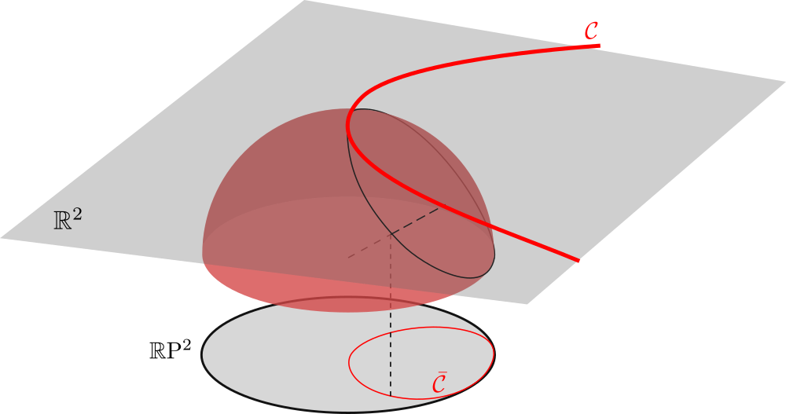
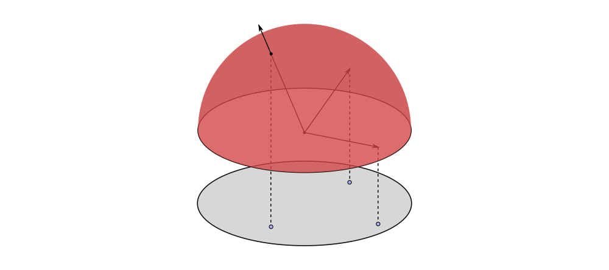
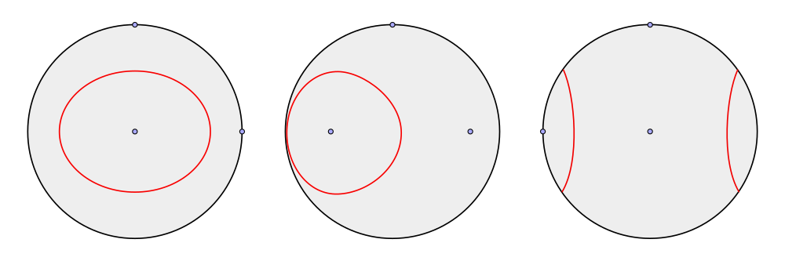

# Interactive projective plane

As is well known, a natural model for the projective plane is a hemisphere with antipodal points on the border identified. The image on right is obtained by projection of the hemisphere onto the disc:

## Usage

Type polynomial from ℝ[X, Y] into the text field to graph zero set of that polynomial. The equation should be expressed as the sum of monomials, where each monomial is in form `rXnYm` with `r` in ℝ and `n`, `m` in ℕ (which stands for <em>r</em>XnYm). Parentheses are not supported for now. You must always type a plus sign in front of a monomial, even if the coefficient is negative (eg. `+-2XY` instead `-2XY`). You can also choose from some examples from the drop-down menu.

You can change coordinate system (or equivalently, transform curve by projective transformation), by dragging vertices of coordinate triangle or using scroll wheel while holding pointer above one of the vertex (scrolling multiplies the corresponding column of transformation matrix with scalar). Double clicking on one of vertex changes sign of third coordinate of the corresponding column. With these three operations, it is possible to define all matrix in PGl₃ℝ.

### Example

Equation x2+2y2-1=0 defines an ellipse in the plane. If we rotate base vectors (blue dots), we will first get a parabola and then a hyperbola. This shows us that non-degenerate conic sections are equivalent in the projective plane.

## Bugs

This program sometimes has a problem with drawing reducible curves. For example, typing `X2` will give an empty set, but `X` or `X3` will give one line (as it should be).

## Dependencies 

The only dependency is [Pasukon](https://github.com/gosukiwi/Pasukon) parser generator library which is included as `pasukon.min.js`.

## Credits

The author of this program is [Nikola Ubavić](https://ubavic.rs/?lang=en). 

Author of Pasukon library is Federico Ramirez.

## License

This project is licensed under the MIT License - see the [LICENSE](LICENSE) file for details.
